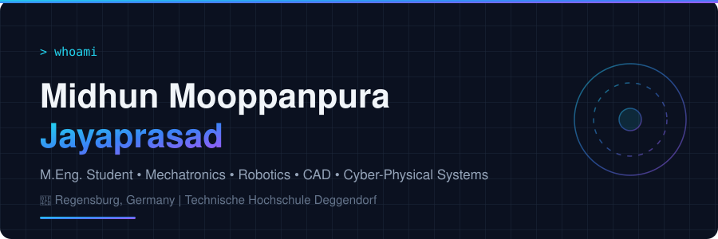
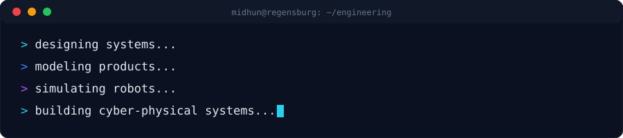
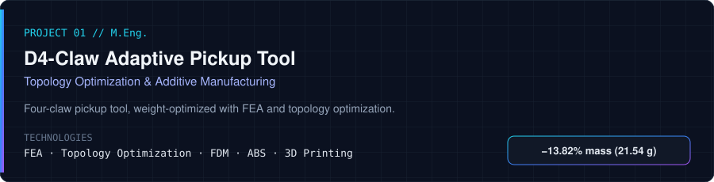
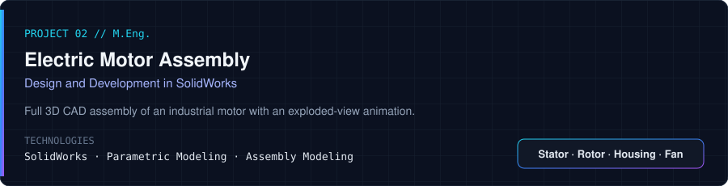
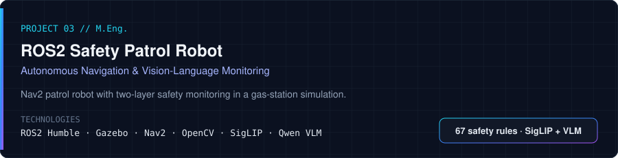
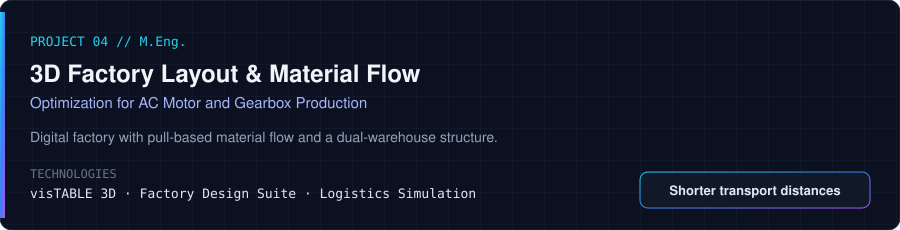
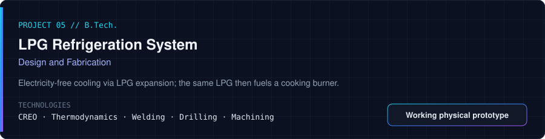

**Mechatronics · Mechanical Design · CAD · Robotics · Cyber-Physical Systems · Simulation · Additive Manufacturing · Computer Vision · AI · Factory Planning**

<!-- TODO LinkedIn:  -->

---

## 👨‍💻 About

Mechatronics and Cyber-Physical Systems Master's student in Germany with professional experience in engineering design and hands-on experience in CAD, product development, robotics, simulation, additive manufacturing and AI-based computer vision.

I am an **M.Eng. Mechatronic and Cyber-Physical Systems** student at **Deggendorf Institute of Technology** with professional experience as a **Designing Engineer** in the switchboard industry, plus practical work in CAD, mechanical design, robotics, simulation, additive manufacturing, factory planning and AI-based computer vision.

🎯 **Currently looking for Werkstudent positions in:** Mechanical Design · Product Development · Mechatronics · Robotics · CAD Engineering · Automation · Engineering Simulation

📍 **Regensburg, Germany**

---

## 🎓 Education

| Degree | Institution | Period | Grade |
|---|---|---|---|
| **M.Eng.** Mechatronic and Cyber-Physical Systems | Technische Hochschule Deggendorf (DIT) | March 2025 – Present | 2.3 (current) |
| **B.Tech.** Mechanical Engineering | APJ Abdul Kalam Technological University (KTU) | March 2018 – August 2022 | 7.31 / 10.0 |

---

## 💼 Professional Experience

### Designing Engineer — Barak and Brazos Engineering LLP
- Executed design projects in the switchboard industry with a focus on technical accuracy and industry standards.
- Produced detailed engineering designs and product documentation using AutoCAD and Autodesk Inventor.
- Applied switchgear knowledge in practical design work with SolidWorks, AutoCAD and Autodesk Inventor.
- Adapted designs to client requirements and technical constraints.
- Collaborated with cross-functional teams to achieve project goals and support continuous improvement.

### Voice Customer Support Agent — Athena Pvt Ltd
- Provided voice-based support for an educational institution.
- Processed admissions and student applications.
- Used clear verbal communication and structured organization in a professional customer-facing environment.

---

## 🛠️ Technical Skills

**CAD & Design** 
        

**Simulation & Engineering Analysis** 
     

**Manufacturing** 
       

**Robotics & Automation** 
     

**Programming** 

**AI & Computer Vision** 
    

**Factory Planning** 
     

**Engineering** 
  

---

## 🚀 Featured Engineering Projects

### 01 · D4-Claw Adaptive Pickup Tool

- Engineered an adaptive four-claw pickup tool.
- FEA used to predict structural integrity and design tolerances under real-world forces.
- Topology optimization reduced component mass by **13.82%** (21.54 g total) while maintaining functionality and performance.
- ABS selected for impact resistance and durability; heat tolerance successfully tested up to **105 °C**.
- Compatible with various FDM printers; post-processed by sanding and smoothing.

**Result:** A lightweight, repeatable gripping solution for automated small-component handling in industrial environments.

GitHub: *GitHub Repository – Add Link*

### 02 · Design and Development of an Electric Motor Assembly

- Modeled an industrial electric motor as a complete 3D CAD assembly with accurately defined internal and external components.
- Applied parametric modeling and rule-based constraints for precise fitment and mechanical integrity.
- Created an exploded-view animation showing the stator, rotor, housing, terminal box and cooling fan subsystems.

**Result:** A digital product representation demonstrating complex assembly management and the link between mechanical design and manufacturing feasibility.

GitHub: *GitHub Repository – Add Link*

### 03 · ROS2 Safety Patrol Robot

- ROS2/Gazebo patrol robot with Nav2 waypoint navigation in a custom gas-station simulation environment.
- Multi-camera perception for 360° situational awareness with real-time visualization in Gazebo.
- Two-layer safety monitoring: **SigLIP** performs fast detection against **67 safety rules**; **Qwen VLM** performs detailed reasoning only when a violation is detected.
- Tested fire/smoke and road-blocking vehicle scenarios; the robot stops and sends an operator alert on a violation.

**Result:** A modular ROS2 framework combining autonomous navigation with explainable vision-language safety monitoring in a simulated industrial environment.

GitHub: *GitHub Repository – Add Link*

### 04 · 3D Factory Layout Design and Material Flow Optimization

- Planned a complete 3D factory layout for AC motor and gearbox production: machining areas, assembly zones and supermarket storage.
- Developed a pull-based material flow strategy; used material flow analysis to reduce transport distances and bottlenecks.
- Designed a dual-warehouse structure, a central cafeteria and optimized inbound/outbound logistics entry and exit points.

**Result:** A digital factory model focused on production throughput and detailed visualization of production and logistics flows.

GitHub: *GitHub Repository – Add Link*

### 05 · Design and Fabrication of an LPG Refrigeration System

- LPG-based refrigeration concept: expansion of LPG produces a cooling effect without electricity.
- Dual-purpose high-pressure circuit: LPG absorbs heat in an evaporator for refrigeration, then feeds a burner for conventional cooking.
- Physical prototype built using welding, drilling and machining.

**Result:** A refrigeration concept for food and medical storage in areas without continuous electricity, using LPG as both cooking fuel and refrigerant.

GitHub: *GitHub Repository – Add Link*

---

## 🌍 Languages & Additional

| | |
|---|---|
| 🇬🇧 English | C2 |
| 🇩🇪 German | B1 |
| 🇮🇳 Malayalam | Native |
| 🚜 Forklift operator | Staplerfahrer license |

---

## 📬 Contact

📧 [midhunforjobs@gmail.com](mailto:midhunforjobs@gmail.com) · 🐙 [github.com/midhunjp00](https://github.com/midhunjp00) · 📍 Regensburg, Germany

M.Eng. Mechatronic and Cyber-Physical Systems · Technische Hochschule Deggendorf

